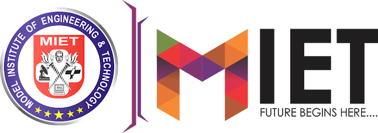

<!-- _class: lead -->
<!-- _paginate: false -->
# SHEPHERD
### Unified declarative cross-platform fleet management system

*Presented by:* Radhey Kalra (2023A1R044) · Aabish Malik (2023A6R057)

<small>Model Institute of Engineering and Technology (Autonomous), Jammu · 2026</small>

---

## The problem on campus

Institutions run computer labs with Linux, macOS, and Windows machines on one network, used by many students.

- Scripts and manual setup leave machines in different states. A lab of 30 machines drifts apart over a semester.
- Failed updates stop midway. Some machines boot, some do not, and nobody knows which without walking over.
- Student access adds constant untracked changes: settings, installs, deleted files.
- Current tools cover one OS each: SCCM and Intune for Windows, Jamf for macOS. Each needs a license and its own server. Updates pulled three times saturate the campus link.

---

## What is Nix

Nix is a package manager and configuration system built around one idea: a configuration file describes the required state, and tooling derives the steps to reach it.

- **Store paths**: Every package builds into an isolated path `/nix/store/<hash>-<name>`. The hash covers all build inputs. Same inputs, same output, on any machine.
- **No dependency conflicts**: Two versions of a library coexist because their paths differ.
- **Generations**: Each configuration activation creates a numbered generation. Switching to the previous one is a symlink change.
- **Flakes**: `flake.nix` plus `flake.lock` pin every input to an exact commit, so two machines evaluate the same configuration into the same system.

Nix defines one machine. This project extends the model to many machines across three operating systems.

---

## Existing tools and what they miss

| Tool | Coverage | Why it does not fit |
| :--- | :--- | :--- |
| **SCCM / Intune** | Windows | Per-seat licenses, policy model without state verification or rollback |
| **Jamf** | macOS | Separate license and server; no Linux or Windows |
| **Ansible / shell scripts** | Any | Push model: each run mutates host state; a failed run leaves the host half-configured |
| **Deep Freeze** | Lab disks | Restores disk on reboot but cannot install updates or change packages |
| **NixOS alone** | One machine | Declarative and rollback-capable, but no central dispatch, inventory, or non-Linux targets |

Shepherd combines the missing pieces: one declarative source for three operating systems, pull-based agents, signed artifacts, and rollback from the model rather than as an add-on.

---

## How it works

A Go server evaluates Nix Flakes into target states. Agents on each machine enforce these states.

- **One source**: Administrators maintain a single Flake repository describing every host.
- **Pull model**: The server sends a SHA-256 target hash. Each agent fetches what it needs and applies it locally.
- **Verification**: Every archive carries an Ed25519 signature. Agents check signatures before unpacking.
- **Rollback**: A failed health check switches the host back to the previous generation.

Target users: campus system administrators, lab assistants, and institutional IT staff.

---

## Onboarding a new machine

1. The technician boots the machine from an enrollment image (USB or PXE) containing `shepherd-srv` and host keys.
2. The agent generates a device key pair and sends a join request.
3. An administrator approves the token in the web console.
4. The agent receives its host name, role, and Flake target over mTLS.
5. It pulls the signed closure from the cache or a LAN peer and verifies each signature.
6. It applies generation 1 and reports the resulting hash. The console lists the node as compliant.

After this, the node applies each new target hash on its own.

---

## System architecture and topology

- **Shepherd server**: Evaluates unified Nix Flakes into target closures.
- **Control channel**: Outbound gRPC over HTTPS port 443 with mTLS.
- **Linux endpoints**: NixOS with ephemeral `tmpfs` root.
- **macOS endpoints**: Nix-Darwin with embedded NanoMDM security.
- **Windows endpoints**: Native Go agent (`shepherd-srv`) maps configurations to Win32, Registry, and LGPO.
- **P2P transport**: Tailcat userspace WireGuard mesh on local networks.

---

## Build cache transfer sequence

- Admin pushes Flake lock update to Git.
- Build workers compile derivations and write outputs to Attic.
- Server sends target hash to endpoints via gRPC.
- Node A downloads missing paths from Attic S3.
- Node B requests chunks from Node A over local LAN Tailcat WireGuard.
- Endpoints verify Ed25519 signatures before unpacking.

---

## Linux node execution workflow

- **Ephemeral root**: The system boots with `tmpfs` mounted at `/`. A reboot clears all changes made after boot.
- **Store protection**: `/nix/store` mounts read-only.
- **Persistent state**: Machine identity and host keys bind from `/persist` using `impermanence`.
- **Rollback**: If post-switch health checks fail, the agent reverts the symlink to generation N-1.

---

## macOS node execution workflow

- **MDM channel**: The server runs an embedded NanoMDM service for FileVault escrow and TCC permissions.
- **Nix channel**: Packages install under `/nix/store` through APFS synthetic firmlinks.
- **Activation**: `darwin-rebuild activate` updates LaunchDaemons and preference plists.
- **Licensing**: No third-party MDM subscription.

---

## Windows node execution workflow

- **Intermediate representation**: The server evaluates Nix into a typed JSON desired-state document.
- **Generation bundle**: `shepherd-srv` writes files to `C:\ProgramData\Shepherd\generations\<hash>\`.
- **State application**:
  - Writes registry keys through Win32 API calls.
  - Compiles and applies LGPO policy files.
  - Installs Winget and MSIX packages.
  - Configures services and queries WMI.
- **Rollback**: If verification fails, the agent re-applies the generation N-1 bundle.

---

## Windows rollback: generation re-application

State diff engines and disk restore points were considered and rejected.

- Diff journals accumulate edge cases; a missed write leaves the host inconsistent.
- Volume Shadow Copy restore points occupy gigabytes and need a reboot.

The agent re-applies the previous bundle instead:

1. Bundles stay on disk under `C:\ProgramData\Shepherd\generations\`.
2. Each bundle holds complete `.reg` files, policy manifests, and package lists.
3. If generation N fails validation, the agent re-runs the generation N-1 bundle.
4. Re-application is idempotent: the host returns to the declared state in seconds, without a reboot.

---

## Networking: Tailcat mesh

- **Target hashes**: Desired-state hashes push over WireGuard. No open inbound ports.
- **Telemetry**: Heartbeats and metrics stream via gRPC, with HTTPS 443 DERP fallback.
- **Remote machines**: Userspace WireGuard (gVisor `netstack`, no TUN conflicts) with DERP relay behind NAT.
- **Lab machines**: Local peers discover via Tailcat Disco and swarm store chunks at LAN speed.

---

## Web console and telemetry

- **Web console (Next.js 16)**: Live node inventory, target generations, and drift state.
- **Telemetry stream**: Ingests node metrics and heartbeats via Go gRPC into PostgreSQL.
- **AI incident insights**: Explains Prometheus alerts and metric spikes with plain-language root-cause notes.
- **AI-recommended tweaks**: Proposes hardware-matched Flake tweaks and configuration diffs for admin approval.
- **1-click revert**: Administrator confirms AI proposals and triggers instant rollback for drifting nodes.

---

## Daily operation

- **Drift reports**: Agents report registry edits, changed services, and untracked packages. The console pairs each report with the assigned generation.
- **Revert**: The administrator selects non-compliant nodes and applies the assigned generation again. Bulk actions cover a whole lab at once.
- **AI-drafted packages**: When course software is missing from repositories, a model drafts the Nix derivation. It deploys only after the same sandboxed build, hash, and reproducibility checks as any other package.
- **Hardware-matched settings**: The model reads CPU, RAM, disk, and GPU reports and proposes Flake changes per machine class (effects off on low-RAM lab desktops, build parallelism matched to core count). The administrator accepts or edits each proposal as a normal Flake diff.
- **Limits**: The assistant produces drafts and summaries. It does not change running machines on its own; every change passes through the same review and generation pipeline as manual work.

---

## Technology stack

| Subsystem | Technology | Role |
| :--- | :--- | :--- |
| **Control plane** | Go 1.23 | HTTP/gRPC server, Nix evaluator, embedded Tailcat DERP relay |
| **Apple MDM** | NanoMDM | APNs push, FileVault key escrow, TCC profiles |
| **Database** | PostgreSQL 16 | Node inventory, optional TimescaleDB telemetry |
| **Build cache** | Attic + S3 | Content-addressed store, FastCDC deduplication |
| **Client agent** | Go 1.23 (`shepherd-srv`) | systemd / launchd / Windows service |
| **Windows engine** | Win32 FFI | Registry writes, LGPO policies, Winget installs |
| **Web console** | Next.js 16 | React 19, TypeScript, Tailwind CSS |
| **Analysis** | LLM pipeline | Log summaries, derivation drafts, hardware tuning proposals |

---

## V.E.T.S justification

| Criterion | How the project meets it |
| :--- | :--- |
| **V: Viability** | Fits one semester. Built on Go 1.23, Nix, WireGuard, PostgreSQL. A three-OS lab testbed is running. |
| **E: Engineering depth** | Nix-to-Win32/LGPO/plist translation, Ed25519 closure verification, userspace WireGuard with NAT traversal, rollback under three seconds. |
| **T: Trend alignment** | Infrastructure as code, immutable OS roots, Zero Trust with outbound-only mTLS, applied models for operations. |
| **S: Social impact** | No SCCM/Intune/Jamf licenses; LAN chunk swarming keeps large rollouts off the campus WAN; labs return to a clean state on reboot. |

---

## Expected outcomes

- **Central server** (`shepherd`): Go 1.23, gRPC services, embedded DERP relay, audit logging.
- **Endpoint agents** (`shepherd-srv`): native clients for Linux, macOS, and Windows.
- **Flake template**: host modules for NixOS, nix-darwin, and the Windows generation engine.
- **P2P distribution**: verified closure transfer between LAN peers.
- **Drift handling**: detection and rollback within three seconds.
- **Analysis pipeline**: log summaries, derivation drafting with validation, hardware-tuned proposals.
- **Benchmarks**: convergence time, WAN traffic saved, rollback reliability.

---

## Implementation timeline

| Phase | Weeks | Activity |
| :--- | :--- | :--- |
| **Phase 1** | 1–3 | Requirement analysis, schema design, multi-OS testbed setup. |
| **Phase 2** | 4–7 | `shepherd` server in Go 1.23, PostgreSQL 16 schema, Flake evaluator. |
| **Phase 3** | 8–11 | `shepherd-srv` agents: Linux tmpfs root, macOS APFS/MDM, Windows Win32/LGPO. |
| **Phase 4** | 12–14 | Tailcat WireGuard mesh, DERP relay, FastCDC LAN transfer. |
| **Phase 5** | 15–16 | Integration testing, drift evaluation, benchmarks, synopsis presentation. |

---

<!-- _class: lead -->
# Summary
- One Flake repository defines Linux, macOS, and Windows machines.
- Agents pull signed target hashes and verify each artifact before activation.
- Failed updates roll back to the previous generation; Linux labs also reset on reboot.
- LAN peers exchange store chunks, so campus bandwidth stays free during rollouts.
- A model drafts derivations and summarizes logs; administrators review every change.
